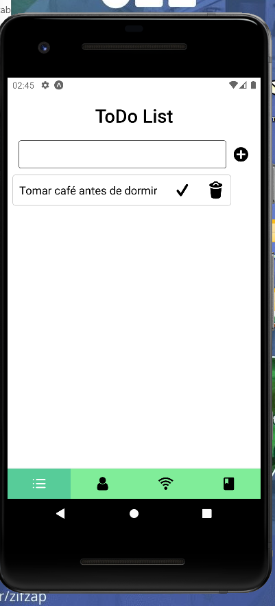
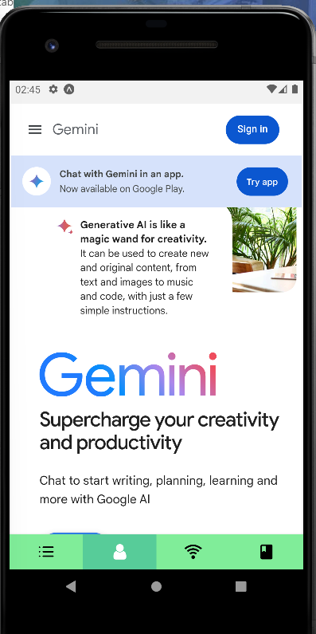

Olá Terráqueo, esta aplicação se refere a uma atividade da disciplina de Programação para dispositivos móveis 1

O programador desta aplicação acabou descobrindo uma excelente biblioteca do React-Native chamada "WebView", e com isso acabou descobrindo que é possível integrar um website em um app, isso é bem legal ! :)

Pois bem, o objetivo do app é ter 4 telas e em cada uma dessas telas apresentar uma interface diferente, e com isso acabou surgindo algumas idéias:

Interface 1 - ToDo -> Te por objetivo ser uma interface onde o usuário consiga adicionar suas tarefas, seja pequenas ou grandes, e com isso consiga marcá-la com concluída e logo após excluí-las. O botão remover consegui fazer funcionar, porém o button Check que marca a Task com concluída, não consegui fazer funcionar ! :(

Interface 2 - Chat -> Tem por objetivo colocar um chat com IA para o usuário interagir com a IA do google, porém o programador aqui acabou perdendo seu projeto antigo usando a IA e acabou não conseguindo implementar esse recurso, fica de amostra a interface do Gemini.

